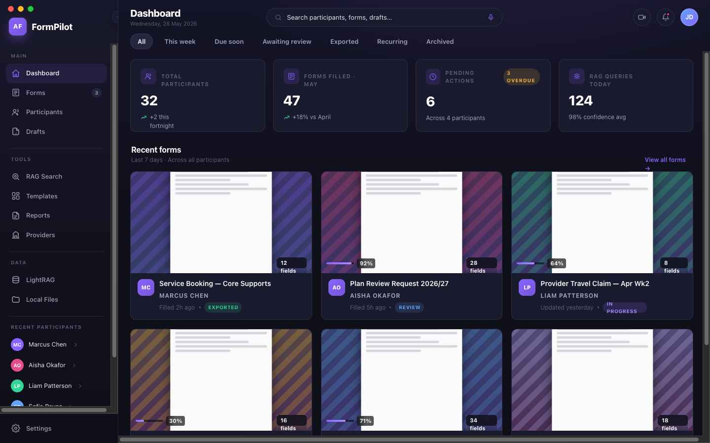
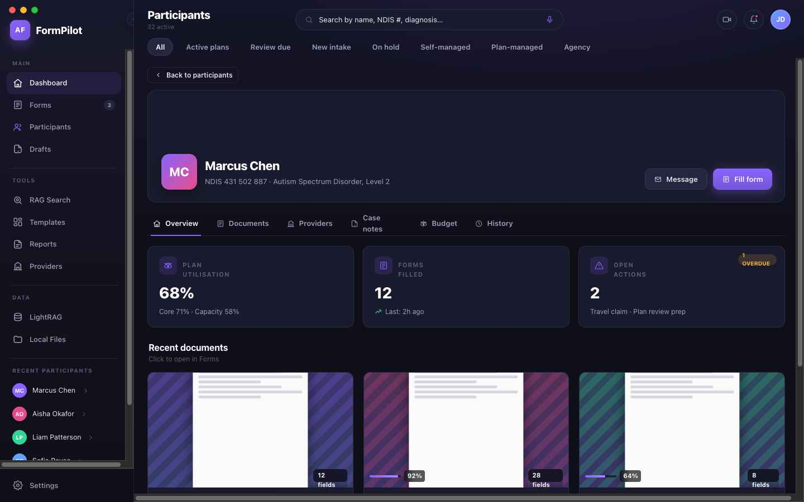
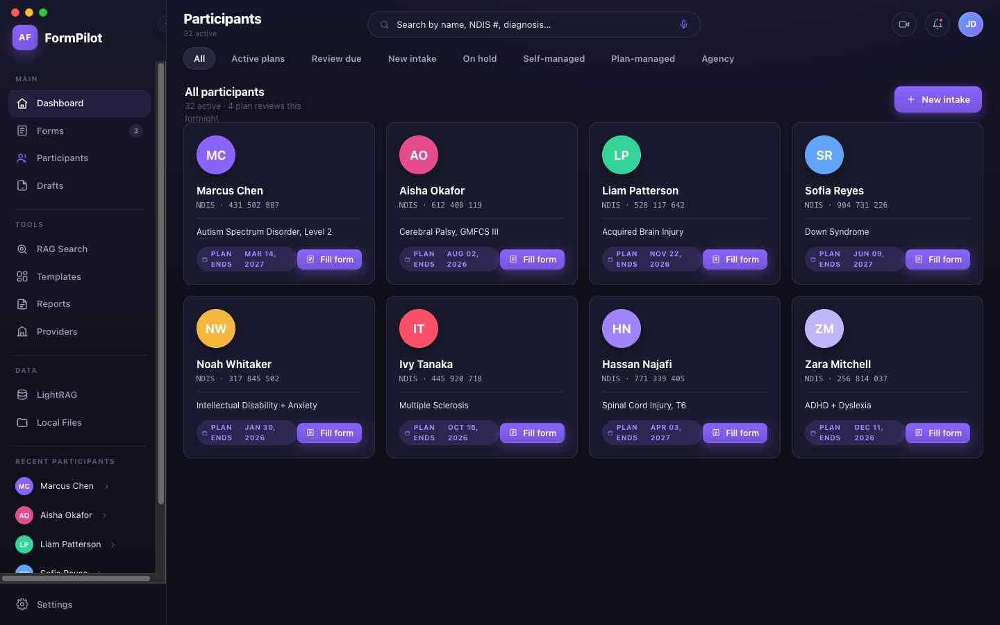
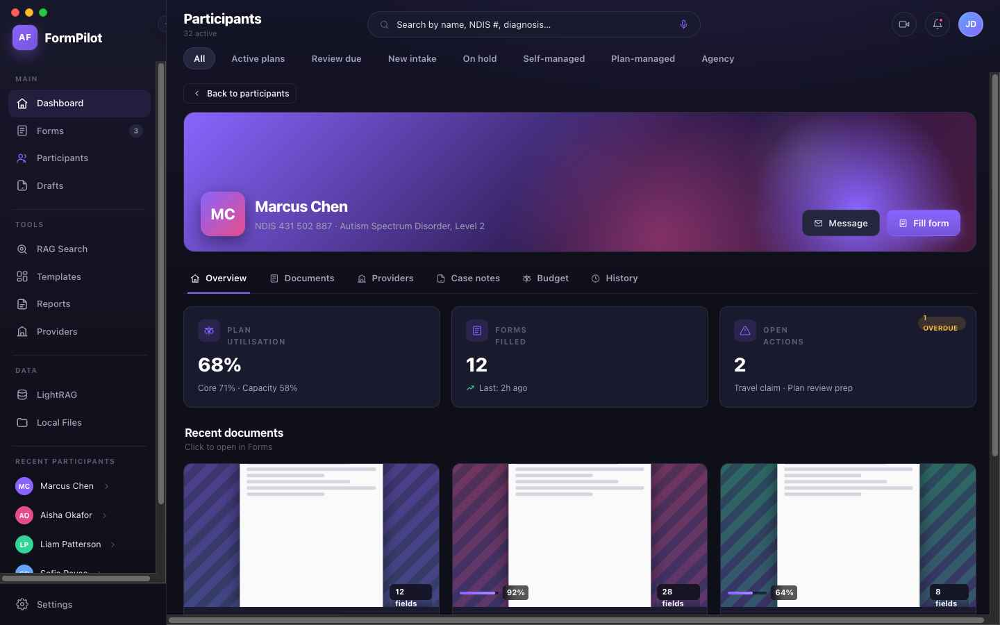

<div align="center">

# Agent Kali

**Intelligent NDIS Form Automation for Support Coordinators**

*Built by [JD Space Digital Systems](https://github.com/userx0234)*



[](#license)
[](#)
[](#tech-stack)
[](#tech-stack)
[](#tech-stack)

</div>

---

## What is Agent Kali?

Agent Kali is a macOS desktop application designed for NDIS (National Disability Insurance Scheme) support coordinators who spend significant time filling out forms, managing participant data, and coordinating services. It uses AI-powered field extraction and retrieval-augmented generation to automate the most tedious parts of the workflow.

### The Problem
Support coordinators fill out dozens of forms per week — service agreements, plan reviews, referral forms, progress reports. Each form requires pulling participant details from multiple sources: NDIS plans, case notes, provider records, email correspondence. This manual process is slow, error-prone, and takes time away from actual participant support.

### The Solution
Agent Kali ingests any PDF form (fillable, locked, flattened, or scanned), extracts the field schema, pulls relevant data from configured sources (RAG knowledge base, local folders, manual entry), and fills the form automatically. Low-confidence fields are flagged for human review.

---

## Features

### Multi-Document Workspace
Open up to 4 forms simultaneously. View them in a 2x2 grid or maximize one for focused work. Each document maintains its own field state, pipeline progress, and fill history.



### Real Participant Data
Connects directly to your Support Coordination folder. Participant cards show real data — names, NDIS numbers, diagnoses, plan dates. Click any participant to see their full profile with documents, providers, case notes, and budget breakdown.



### Participant Detail View
Full participant profiles with hero banner, subtabs for Overview, Documents, Providers, Case Notes, Budget, and History. Quick actions to fill forms or send messages.



### AI-Powered Field Extraction
The dual-path PDF engine handles any form format:
- **Fillable PDFs** — edited directly via native AcroForm
- **Locked / Flattened / Scanned PDFs** — pixel-replicated via ReportLab, then filled on the replica

### RAG Integration
Query your self-hosted LightRAG knowledge base to pull participant data, NDIS pricing, provider details, and historical case notes. Results auto-populate form fields with confidence scoring.

### Reports & Templates
Browse and generate reports connected to your participant folders. Pre-built report types: Plan Reassessment, Support Letter, Budget Utilisation, Monthly Summary, Outcome Reports, Progress Reports.

### Dashboard
At-a-glance overview of your caseload: total participants, forms filled, pending actions, recent activity. Quick action buttons for common workflows.


---

## Tech Stack

| Layer | Technology |
|-------|-----------|
| Desktop | Electron 30 (macOS, frameless window) |
| Frontend | React 18 + TypeScript + Vite |
| State | Zustand |
| Styling | CSS Custom Properties (dark purple theme) |
| PDF Rendering | react-pdf (pdfjs-dist) |
| PDF Engine | Python FastAPI sidecar (PyMuPDF + ReportLab) |
| RAG | LightRAG (self-hosted, Tailscale VPN) |
| Icons | Custom inline SVG (Lucide-style, 47 icons) |

---

## Architecture

```
┌──────────────────────────────────────────┐
│              Electron Main               │
│  ┌──────────┐  ┌──────────┐  ┌────────┐ │
│  │  Window   │  │   IPC    │  │Sidecar │ │
│  │ Manager   │  │  Bridge  │  │Spawner │ │
│  └──────────┘  └──────────┘  └────────┘ │
└──────────────┬───────────────────┬───────┘
               │                   │
    ┌──────────▼──────────┐  ┌────▼─────────────┐
    │   React Renderer    │  │  Python Sidecar   │
    │  ┌──────────────┐   │  │  ┌─────────────┐  │
    │  │   Sidebar    │   │  │  │  /ingest     │  │
    │  │   TopBar     │   │  │  │  /schema     │  │
    │  │   Views      │   │  │  │  /fill       │  │
    │  │   Store      │   │  │  │  /export     │  │
    │  └──────────────┘   │  │  └─────────────┘  │
    └─────────────────────┘  └───────────────────┘
```

---

## Getting Started

### Prerequisites
- macOS 12+
- Node.js 18+
- Python 3.10+

### Installation

```bash
git clone https://github.com/userx0234/agent-kali.git
cd agent-kali
npm install
cd python && python3 -m venv .venv && ./.venv/bin/pip install -r requirements.txt && cd ..
```

### Development

```bash
npm run dev
```

### Build

```bash
npm run build
```

---

## Configuration

### Participant Data
By default, Agent Kali scans `~/Desktop/Support-Coordination/` for participant folders. Each subfolder represents a participant with their documents organized in subdirectories (Case-Notes, Correspondence, Reports, etc.).

### RAG
Configure your LightRAG endpoints in `config/agent.config.json`. Requires Tailscale VPN connection to the self-hosted RAG instance.

### PDF Engine
The Python sidecar starts automatically on `npm run dev`. Default LLM model is configurable in `config/agent.config.json`.

---

## Project Structure

```
agent-kali/
├── electron/           # Electron main process
│   ├── main.ts         # Window creation, app lifecycle
│   ├── sidecar.ts      # Python sidecar management
│   ├── preload.ts      # IPC bridge to renderer
│   └── ipc/            # IPC handlers (files, RAG, sidecar, participants)
├── src/                # React renderer
│   ├── App.tsx         # Root component with routing
│   ├── index.css       # Full design system (1400+ lines)
│   ├── components/     # UI components
│   │   ├── Layout/     # Sidebar, TopBar
│   │   ├── Dashboard/  # Dashboard view
│   │   ├── Forms/      # Multi-doc workspace
│   │   ├── Participants/  # Participant cards + detail
│   │   ├── Reports/    # Report browser
│   │   └── ...         # Other views
│   ├── store/          # Zustand state
│   └── lib/            # Utilities, mock data, IPC clients
├── python/             # FastAPI sidecar
│   ├── server.py       # API endpoints
│   └── requirements.txt
├── config/             # Runtime config
└── public/             # Static assets, logo
```

---

## License

MIT License — see [LICENSE](LICENSE) for details.

---

<div align="center">

**Agent Kali** — Built with precision by **JD Space Digital Systems**

</div>
